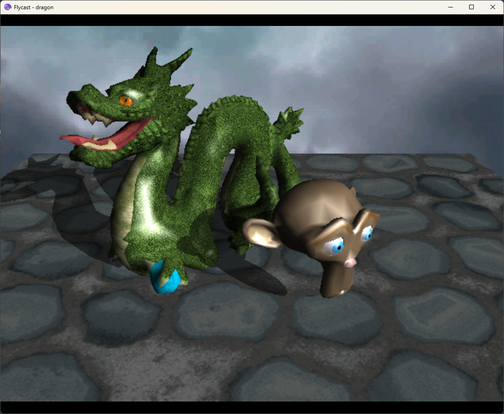

## Dreamcast version

This version was implemented using the [KallistiOS SDK](https://github.com/KallistiOS/KallistiOS), and tested in Flycast. The camera can be moved with the joystick to rotate and the right and left triggers to get closer/farther from the scene. The demo use a double-buffered setup, running at 30 or 60 FPS depending on the performances. 

Te Dreamcast is a very interesting machine due to its tile-based rasterizer, which unlocked interesting abilities such as order-independent transparency and modifier volumes toggling different textures/color sets. The console provides a fixed-pipeline rasterizer with perspective correct interpolation and texture mapping, but vertex transformation and shading have to be done on the CPU. 

Shadows are rendered dynamically by relying on modifier volumes to implement basic shadow volumes. To alleviate artefacts, specific versions of each sahdow casting mesh are used, to ensure convexity and good tessellation when projecting the geometry in the light's direction.
Textures are paletized on 8 bits and using RGB565 colors to free up space, combined with a codebook-based block compression supported by the hardware.

There is no clipped triangles generation: as soon as a triangle has a vertex outside the frustum, it is completely discarded. I simply rely on meshes having a high density of triangles and the Dreamcast having a safety guard band around the visible screen to avoid any on-screen clipped triangle. 
